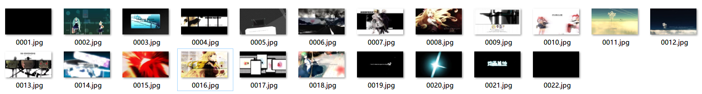
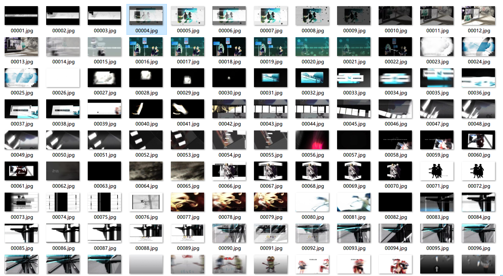
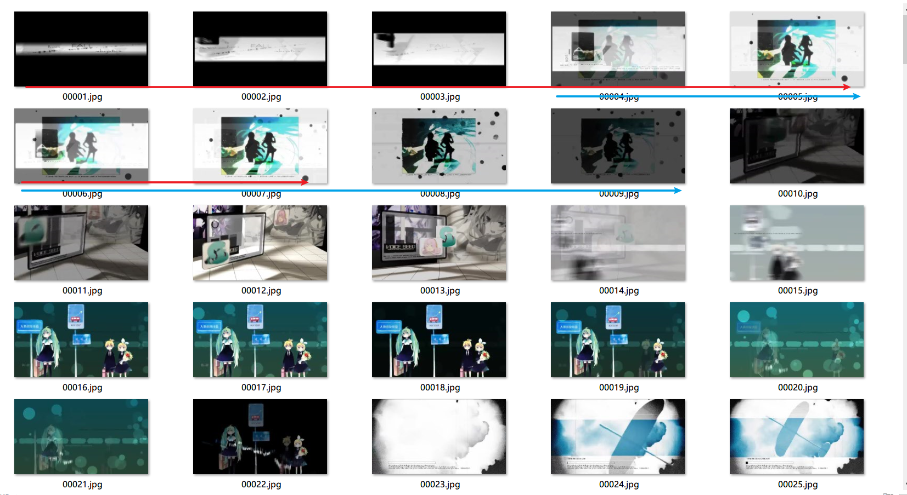
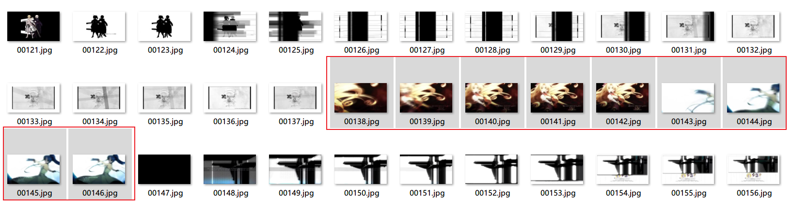
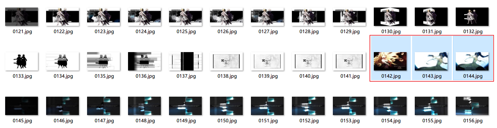

# ffmpeg 抽帧

- 下载并解压ffmpeg主体，配置系统环境变量path，方便命令行使用。

- 使用ffprobe提取出**IPB帧**的统计信息。


## 准备例子

准备好一个示例视频，这里以2010秋季OP为例子。这个视频的基本信息为：

```bash
General
Complete name                  : D:\BaiduNetdiskDownload\Spotsommer_Mumpitz..6722544.flv
Format                         : Flash Video
File size                      : 9.95 MiB
Duration                       : 1 min 47 s
Overall bit rate               : 774 kb/s
Tagging application            : Version 1.9
description                    : Bilibili VXCode Swarm Transcoder v0.2.30(gap_fixed:False)

Video
Format                         : AVC
Format/Info                    : Advanced Video Codec
Format profile                 : High@L3.1
Format settings                : CABAC / 6 Ref Frames
Format settings, CABAC         : Yes
Format settings, Reference fra : 6 frames
Codec ID                       : 7
Duration                       : 1 min 47 s
Bit rate                       : 642 kb/s
Width                          : 960 pixels
Height                         : 540 pixels
Display aspect ratio           : 16:9
Frame rate mode                : Constant
Frame rate                     : 30.000 FPS
Color space                    : YUV
Chroma subsampling             : 4:2:0
Bit depth                      : 8 bits
Scan type                      : Progressive
Bits/(Pixel*Frame)             : 0.041
Stream size                    : 8.48 MiB (85%)
Color range                    : Limited
Matrix coefficients            : BT.470 System B/G

Audio
Format                         : AAC LC
Format/Info                    : Advanced Audio Codec Low Complexity
Codec ID                       : 10-2
Duration                       : 1 min 47 s
Bit rate                       : 105 kb/s
Channel(s)                     : 2 channels
Channel layout                 : L R
Sampling rate                  : 48.0 kHz
Frame rate                     : 46.875 FPS (1024 SPF)
Compression mode               : Lossy
Delay relative to video        : 100 ms
Stream size                    : 1.44 MiB (14%)

```

关键信息如下：

- 时长1 min 47 s，一共60+47=107秒。这里只是粗略数值。
- Video的 Frame rate 为 30.000 FPS。


## 探测帧信息

  ```bash
  ffprobe -i .\Spotsommer_Mumpitz..6722544.flv -v quiet -select_streams v -show_entries frame=pkt_pts_time,pict_type
  ```

  - -v quiet: 表示安静模式，减少logging信息。
  - -select_streams v：表示只选取video进行处理。
    https://ffmpeg.org/ffmpeg.html#toc-Stream-specifiers-1
  - -show_entries frame=pkt_pts_time,pict_type： 表示只显示frame信息，并且frame信息只显示pkt_pts_time和帧类型。

> 这里，帧类型容易理解，分为PBI三种类型。但是pkt_pts_time是什么含义？

输出的结果很长，这里选取一段连续的片段进行分析：

```bash
...
[FRAME]
pkt_pts_time=15.067000
pict_type=P
[/FRAME]
[FRAME]
pkt_pts_time=15.100000
pict_type=I
[/FRAME]
[FRAME]
pkt_pts_time=15.133000
pict_type=B
[/FRAME]
...
```

- 相邻的FRAME的pkt_pts_time差值为0.033，0.033*帧率30=0.99 -> 1。的确证明了这里是一帧。

由于这个信息很长，terminal往往无法保存所有信息，一般需要将stdout输出到本地文件，方便使用其他编辑器查看。

```bash
ffprobe -i .\Spotsommer_Mumpitz..6722544.flv -v quiet -select_streams v -show_entries frame=pkt_pts_time,pict_type > spot.txt
```

注意末尾的`> spot.txt`，在windows系统中，将标准输出管道定向到文件。


## 抽取I帧

```bash
ffmpeg -i .\Spotsommer_Mumpitz..6722544.flv -vf "select=eq(pict_type\,I)"  -vsync vfr -qscale:v 1 -f image2 ./I-frames/%04d.jpg
```

其中：

- -vf "select=eq(pict_type\,I)"

  表示只取I帧。

- -vsync vfr 这里务必使用vfr，使用cfr会使用编码器复制多个图片，导致输出3000+图片。

  > -vsync parameter
  >
  > Video sync method. For compatibility reasons old values can be specified as numbers. Newly added values will have to be specified as strings always.
  >
  > 1, cfr
  >
  > Frames will be duplicated and dropped to achieve exactly the requested constant frame rate.
  >
  > 2, vfr
  >
  > Frames are passed through with their timestamp or dropped so as to prevent 2 frames from having the same timestamp.

- -qscale:v 2

  qscale表示质量缩放，:v表示只应用于video部分，取值为1-31，值约小，质量越高。这里取1。

- -f image2

  使用image2 分路器

  > https://www.ffmpeg.org/ffmpeg-formats.html#image2-2

结果，生成22张图片。



对比原视频可以看出，原作的镜头组远超过22个，所以抽取I帧不能达到目的，这个方法不可行。但是这个方法可以迅速为一个MAD生成大致的关键帧预览列表。


## 抽取场景转换帧

初步尝试：

```bash
ffmpeg -i .\Spotsommer_Mumpitz..6722544.flv -filter:v "select='gt(scene,0.1)',showinfo" -f null - 2>&1
```

这会输出到控制台。下图为末尾的log。

```bash
...
[Parsed_showinfo_1 @ 00000221fb31fcc0] n: 233 pts: 100667 pts_time:100.667 pos: 10282619 fmt:yuv420p sar:1/1 s:960x540 i:P iskey:0 type:B checksum:7D3ED25F plane_checksum:[0189C153 E751B666 A5C75A97] mean:[41 130 125] stdev:[57.8 3.7 7.7]
[Parsed_showinfo_1 @ 00000221fb31fcc0] color_range:tv color_space:bt470bg color_primaries:unknown color_trc:unknown
frame=  234 fps=115 q=-0.0 size=N/A time=00:01:42.18 bitrate=N/A speed=50.1x
frame=  234 fps=111 q=-0.0 Lsize=N/A time=00:01:47.69 bitrate=N/A speed=51.3x
video:122kB audio:20196kB subtitle:0kB other streams:0kB global headers:0kB muxing overhead: unknown
```

但是因为仅仅是一大段文字，没有实际意义。

---

所以下面将抽取结果输出为图片，然后人工判断是否达到期望。

```bash
ffmpeg -i .\Spotsommer_Mumpitz..6722544.flv -filter:v "select='gt(scene,0.1)',showinfo" -vsync 0 ./change-frames/%05d.jpg
```



一共234张图片，按序号递增排列。

看起来不错，于是我们可以放大图片预览看下效果。



- 红线表示第1个场景
- 蓝线表示第2个场景
- ...

> 参考链接：
>
> [16.16 select, aselect](https://www.ffmpeg.org/ffmpeg-filters.html#toc-select_002c-aselect)
>
> [使用ffmpeg：如何进行场景变化检测？有时间码吗？](https://www.it-swarm.cn/zh/video/%E4%BD%BF%E7%94%A8ffmpeg%EF%BC%9A%E5%A6%82%E4%BD%95%E8%BF%9B%E8%A1%8C%E5%9C%BA%E6%99%AF%E5%8F%98%E5%8C%96%E6%A3%80%E6%B5%8B%EF%BC%9F%E6%9C%89%E6%97%B6%E9%97%B4%E7%A0%81%E5%90%97%EF%BC%9F/823987365/)


### 参数调优问题的求解

上面这种方式提取出来的场景变化帧，效果取决于这个参数：`select='gt(scene,0.1)`

这里0.1表示场景可能变化的概率，0.1是很低的概率。如果对0.1的效果不满意，那么可以改变概率。

下面我们继续尝试。这次分别采取0.05，0.2的概率值进行实验。结果汇总如下。

| 概率值   | 生成图片数 |
| -------- | ---------- |
| **0.05** | **452**    |
| 0.1      | 234        |
| **0.2**  | **101**    |

以0.1为参考值，当值变小时，例如0.05，生成的图片数变多，此时镜头划分更加精确。

而0.2这个值生成图片数101，比0.1还少，明显不是我们想要的发展方向，舍弃。

但是，这个概率值不是越小越好，因为值越小，图片数生成越多。当值小到一个极小值时，会退化为没有任何抽帧。此时输出的结果，就和完全输出原视频的每一帧一样。

而且，这个值没有最优解，根据视频的场景信息，ffmpeg的内部切分算法，导致的结果也会不同。

**所以，这个值的确定，我们目前只能人工尝试几次，对比不同值的生成趋势，然后选择一个稍微满意的值即可。**

如果不想使用这个方法，可以考虑硬编码解析，也就是下面的固定帧间隔抽帧（均匀采样抽帧）。


## 自定义帧率均匀抽帧

```bash
# -r 抽取的帧率，即从视频中每秒钟抽取图片的数量。4代表每秒抽取4帧。
ffmpeg -i .\Spotsommer_Mumpitz..6722544.flv -r 4 -q:v 2 -f image2 ./uniform-extract-4ps/%04d.jpg
```

这里抽取结果为433张。它的结果和抽取场景转换帧的结果张数很像。但是存在下面的缺点：

- 过于死板，对于快速变化的分镜，提取的信息比较少。举例：

  | 抽取场景转换帧                                               | 自定义帧率均匀抽帧(每1秒抽取4帧)                         |
  | ------------------------------------------------------------ | -------------------------------------------------------- |
  |  |  |

  这个例子中，人物入场非常快速，抽取场景转换帧保留的分镜信息（9张）比固定帧间隔抽帧更多（3张）。从抽取场景转换帧中，我们可以得到更多关于人物过渡的镜头信息。相反，固定帧间隔抽帧在这个方面表现欠佳。


## 保留提取帧图像的时间位置

上面的例子中，我们关注的是变化帧的排列分布信息，而忽略了它的时间位置。如果可以的话，我们希望在抽取每一帧的时候，保留某帧对应的时间点信息。但是，目前在ffmpeg似乎没找到开箱即用的参数设置API。


## 小结

在本文中，我们探讨了使用开源组件ffmpeg来处理视频帧的提取。


## 参考链接

- [FFmpeg视频抽帧那些事](https://zhuanlan.zhihu.com/p/85895180)

